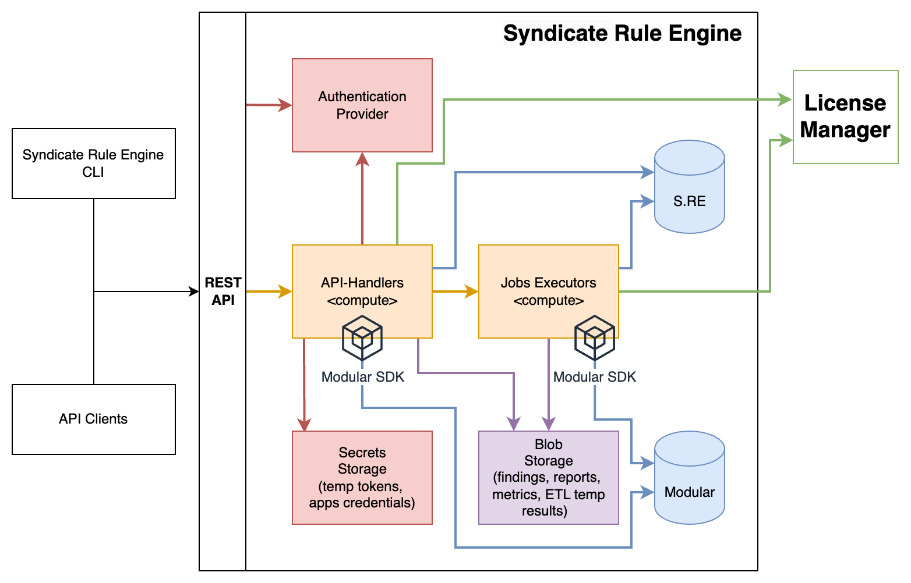

# EPAM Syndicate Rule Engine. Quickstart

## About Syndicate Rule Engine

### What is Syndicate Rule Engine

Syndicate Rule Engine is a serverless service-wrapper over another opensource tool - [Cloud Custodian](https://cloudcustodian.io/). This quickstart guide is written assuming that you are familiar with it. 

### What does Syndicate Rule Engine do?

Syndicate Rule Engine was created to facilitate the process of scanning an infrastructure by allowing to use pre-defined Cloud Custodian rules from some external repository. 
It allows to manage such repositories, pull rules from them, build rule-sets from the rules according to different criteria, execute scans and generate reports.


## Getting started

- [Architecture](#architecture)
- [Installation](#installation)
- [Configuration](#configuration)
- [Usage](#usage)


## Architecture

### AWS infrastructure
The API of the service is built on AWS Lambdas and API Gateway (or K8s and bottle/gunicorn server). DynamoDB (or MongoDB) is the primary database. Together with S3 (or MinIO) they are used to keep data. 
AWS Batch (or K8s) is used to perform scans. Here is a superficial diagram:



Detailed info with diagrams inside `.syndicate-rule-engine/docs` folder

### Core data classes

All the core models can be split into two parts:

- Modular SDK models - all the models that are inherited from Modular SDK;
(Detailed info with diagrams there: [Modular SDK Documentation](https://github.com/epam/modular-sdk/blob/main/README.md))
- Syndicate Rule Engine specific models;

#### Modular SDK models

##### Customers

Customer is a top-level entity. It bounds all the sub-models to one logical client of the service. It can be, for example, `EPAM`. 

##### Tenants

Each tenant represents one account on any cloud infrastructure. Syndicate Rule Engine currently supports only `AWS`, `AZURE` and `GOOGLE` tenants:

- **AWS** account_id
  Represents one AWS account;

- **AZURE** subscription_id
  Represents one Azure subscription (do not confuse with Azure native tenants)

- **GOOGLE** project_id
  Represents one Google project;

##### TenantSettings

Auxiliary model, can contain some settings specific for certain tenants. Inherited from Modular SDK models, from the `Syndicate Rule Engine` side it is used to keep excluded rules for some tenants.

##### Applications

Applications represent access to external services and accounts. Actual sensitive data (passwords, secret keys, certificates) are stored in AWS SSM Secure String Parameter Store. 
Applications can contain names of SSM Parameters, api links if necessary and other data required to access an external service. Each application is bound to one customer.

Syndicate Rule Engine uses applications to:

- Retrieve credentials with access (read) to client's accounts;
- Keep license keys for individual Customer (it's explained more verbosely in the [Usage](#usage) section)

##### Parents

A parent is a kind of intermediate (connection) between tenants and applications. One parent can have only one bound application, whereas one tenant can have multiple bound parents. Parent, for example, can connect a set of tenants to some application (all within one customer). Generally, parents can bear some business logic and imply it to tenants. 

Now some concrete case: imagine we have a customer which has its own AWS Organization with N accounts. To be able to scan all these accounts using Syndicate Rule Engine we must: 

1. Create our tenant per each account;
2. Create an application with AWS Organization credentials (that have read access to all the accounts);
3. Bound the application to some subset of tenants or to all the tenants;

Of course, you can create an application per each tenant with its own credentials, if you want. More or less the same logic can be applied to Azure subscriptions and Google projects.

In terms of Syndicate Rule Engine, parents can additionally be used to keep excluded rules (as well as tenant settings). Also, parents can declare whether some tenants must be scanned (this information is used only by Maestro).

Detailed info about Tenant/Parent/Application model: [Modular SDK Documentation](https://github.com/epam/modular-sdk/blob/main/README.md)

#### Syndicate Rule Engine native models

##### SREEvents

##### SREJobs

##### SREReportMetrics

##### SREPolicies

##### SREReportStatistics

##### SREResources

##### SREResourceExceptions

##### SRERetries

##### SRERoles

##### SRERules

##### SRERuleSources

##### SRERulesets

##### SREScheduledJobs

##### SRESettings

##### SREUsers

What you should understand is that SRE was designed as a Maestro3 pluggable service. That is why it uses Modular SDK models under hood (which are basically maestro models). 
So, all the customers and tenants are supposed to be managed (created, deleted) by Maestro and not by SRE itself. SRE should be installed near Maestro and then just use its existing customers and tenants to scan them. 

Of course, SRE can be a standalone installation without a need to have Maestro. You can actually create some customers using `src/main.py` script (see [Configuration](#configuration) chapter).

## Installation

Detailed installation guide available in the [installation documentation](./docs/esre01_user_guide.pdf).

## Configuration

### main.py script

Once the service has been deployed (either on AWS or locally), it must be initially configured using `src/main.py` script. The purpose of this configuration is to create SYSTEM customer and user & your target customer and user. 
Also, during the configuration some necessary settings will be set. To begin the configuration process, follow the steps:

Move to `src` folder in Syndicate Rule Engine's root folder

```bash
cd /path/to/syndicate-rule-engine/src
```

Create `.env` file from `.env.example`:

```bash
cp .env.example .env
```

Set all the necessary envs:

```bash
# exclusively on-prem envs
# name=value  # [syndicate alias name]
# if alias name is not specified, it's the same as env name.
# Commented envs are necessary only for saas
_service_mode=saas  # saas | docker
_db_name=syndicate_rule_engine

SERVICE_MODE=${_service_mode}

# <buckets>
SRE_REPORTS_BUCKET_NAME=reports
SRE_RULESETS_BUCKET_NAME=rulesets
SRE_STATISTICS_BUCKET_NAME=statistics
SRE_METRICS_BUCKET_NAME=metrics
...
```

**Note**, for AWS installation you need to set `SERVICE_MODE` equal to `saas`. For on-prem installation you need to set `SERVICE_MODE` equal to `docker` and also set Minio, Mongo and Vault (see `.env.example`).

##### On-prem specific steps

```bash
python main.py create_buckets  # creates buckets in Minio
```

```bash
python main.py init_vault  # initialize vault token
```

```bash
python main.py create_indexes  # creates mongodb indexes
```

##### Saas & on-prem common steps

Before configuring the environment you can optionally parse rule sources to retrieve all the available rule ids and parse standards from Excel tables:

```bash
python main.py parse_rule_source ...
```

```bash
python main.py parse_standards ...
```

**Note:** the commands above will save the parsed data to `.tmp` folder in your working directory. Other `main.py` commands by default will look into settings data to `.tmp` in your workdir as well. 
If the folder or necessary setting is missing, it will be skipped.

The following command will set some basic settings to `Settings` table in MongoDB and some settings to rulesets bucket.

```bash 
python main.py env update_settings --lm_api_link $LM_API_LINK
```

The next command will create a system user. You will receive system user's username and password

```bash
python main.py env create_system_user --username admin
```

Create a standard customer:

```bash
python main.py env create_customer --customer_name $YOUR_CUSTOMER_NAME
```

Create a standard user. This command will give username and password

```bash
python main.py env create_user --username $YOUR_CUSTOMER_USER --customer_name $YOUR_CUSTOMER_NAME
```

The configuration is finished if SYSTEM customer & user and at least one standard customer & user are created, necessary settings are set.

## Usage

To use the tool you must own an API link (received in [Installation](#installation) section) and username & password from your user. You can use the api directly ([link to api documentation](docs/api/README.md)) or use the CLI tool. Here we will demonstrate basic CLI actions.


### Initialization
First, make sure you have `sre` CLI installed:
```bash
$ sre --version
sre, version 5.8.1
```

Before executing any valuable commands you must configure the tool (specifying a link to the API) and log in using the credentials you've been supplied with. In the case below `$SRE_API_LINK` contains the link to the API, 
`$USERNAME` and `$PASSWORD` contain the username and password accordingly.
```bash
sre configure --api_link $SRE_API_LINK
sre login --username $USERNAME --password $PASSWORD
```
**Note:** login session is one hour long. You will have to log in every sixty minutes.

Execute health check to make sure everything is OK:
```bash
$ sre health_check
+-----------------------------+--------+---------------------------------------------------------+
|             Id              | Status |                         Details                         |
+-----------------------------+--------+---------------------------------------------------------+
|        buckets_exist        |   OK   |                            —                            |
|      coverages_setting      |   OK   |            AWS: True; AZURE: True; GCP: True            |
|    event_driven_rulesets    |   OK   |            AWS: True; AZURE: True; GCP: True            |
| license_manager_client_key  |   OK   | kid: 46e94303-480f-4cbc-8998-dff8251100f4; secret: True |
| license_manager_integration |   OK   |                host: http://0.0.0.0:8050                |
|      minio_connection       |   OK   |                            —                            |
|     mongodb_connection      |   OK   |                            —                            |
| report_date_marker_setting  |   OK   |                            —                            |
|      rule_ids_setting       |   OK   |            AWS: True; AZURE: True; GCP: True            |
|   system_customer_setting   |   OK   |                    name: SRE_SYSTEM                     |
|      vault_auth_token       |   OK   |            token: True; secrets_engine: True            |
|      vault_connection       |   OK   |                            —                            |
+-----------------------------+--------+---------------------------------------------------------+
```

### Basics

Now you have your customer and a user, which is connected to this customer, under control! You've been given a policy `admin_policy` which has all the available permissions except 
`customer:create_customer`, `customer:remove_customer` and a role `admin_role` which has `admin_policy` attached and is used by your customer by default.

Describe your customer by executing the command:
```bash
$ sre customer describe
+------------------+------------------+--------+----------------------------------+
|       Name       |   Display name   | Admins |           Latest login           |
+------------------+------------------+--------+----------------------------------+
| EXAMPLE_CUSTOMER | Example Customer |   —    | Monday, May 15, 2025 03:00:30 PM |
+------------------+------------------+--------+----------------------------------+
```
Describe your tenant:

```bash
$ sre tenant describe
+--------------------+------------------------------------+------------------+-----------+--------------+-------------------------+
|        Name        |          Activation date           |  Customer name   | Is active |   Project    |         Regions         |
+--------------------+------------------------------------+------------------+-----------+--------------+-------------------------+
| EXAMPLE_TENANT_AWS | Tuesday, July 26, 2025 09:50:42 AM | EXAMPLE_CUSTOMER |   True    | 323549576358 | EU-CENTRAL-1, EU-WEST-1 |
+--------------------+------------------------------------+------------------+-----------+--------------+-------------------------+
```

Describe your roles:

```bash
$ sre role describe
+------------+------------------+--------------+-----------------------------------------+
|    Name    |     Customer     |   Policies   |               Expiration                |
+------------+------------------+--------------+-----------------------------------------+
| user_role  | EXAMPLE_CUSTOMER | user_policy  | Saturday, November 11, 2025 01:47:40 PM |
| admin_role | EXAMPLE_CUSTOMER | admin_policy | Saturday, November 11, 2025 01:47:40 PM |
+------------+------------------+--------------+-----------------------------------------+
```
As you are starting to understand on your own, to see the policies use the following command:
```bash
$ sre policy describe --json
```
**Note:** `--json` flag is available everywhere. It forces the output to be shown as a JSON instead of a table. In case of `sre policy describe` the output is too huge and inconvenient for a table.

## Licensed flow

License flow is quite simple. You can receive so-called tenant-license-key from the license manager. Then you just need to add this license on SRE side and execute the job for some tenant. 
The following commands assume that your tenant license key is in env `$TENANT_LICENSE_KEY` and the license under this key allows some AWS ruleset for tenant `EXAMPLE_TENANT_AWS`. 
All the keys or IDs that are used in the tutorial are mocked.

Describe rule-sets and make sure there are none:

```bash
$ sre ruleset describe
+---------------------+
|       Message       |
+---------------------+
| No items to display |
+---------------------+
```

Activate application for your customer specifying tenant-license-key:

```bash
$ sre application add --cloud AWS --tenant_license_key $TENANT_LICENSE_KEY --cloud_application_id 9fsdfsdf-01b3-4554-8ba3-4b427f20730f --json
{
    "trace_id": "bfe6c17a-a55e-4f1e-a4d9-b02a875c08f7",
    "items": [
        {
            "application_id": "9035e4dd-a413-41de-94b6-4bb02a9cca89",
            "customer_id": "EXAMPLE_CUSTOMER",
            "description": "SRE application",
            "meta": {
                "username": null,
                "host": "0.0.0.0",
                "port": 8000,
                "protocol": "HTTP",
                "stage": "caas",
                "awsAid": "9fsdfsdf-01b3-4554-8ba3-4b427f20730f",
                "azureAid": null,
                "googleAid": null,
                "awsLk": "bba7a90b-0c4d-4eed-81fc-5653a160bc30",
                "azureLk": null,
                "googleLk": null
            }
        }
    ]
}
```

Describe rule-sets to make sure they appear after adding the license:

```bash
$ sre ruleset describe
{
    "trace_id": "a948341f-52e7-44f5-9548-fa8e136154f2",
    "items": [
        {
            "customer": "SRE_SYSTEM",
            "name": "OP_FULL_AWS",
            "version": "1.0",
            "cloud": "AWS",
            "rules_number": 536,
            "active": true,
            "allowed_for": "ALL",
            "license_keys": [
                "bba7a90b-0c4d-4eed-81fc-5653a160bc30"
            ],
            "licensed": true,
            "status": {
                "code": "READY_TO_SCAN",
                "last_update_time": "2025-05-15T13:01:28.932346Z",
                "reason": "Assembled successfully"
            }
        }
    ]
}
```

Execute scan for your tenant:

```bash
$ sre job submit --tenant_name EXAMPLE_TENANT_AWS
+--------------------------------------+-----------+----------------------------------+-----------------------+---------------------+
|                Job id                | Job owner |           Submitted at           | Customer display name | Tenant display name |
+--------------------------------------+-----------+----------------------------------+-----------------------+---------------------+
| 4f3e6d98-1614-45a0-aedc-2f3afd068327 |  example  | Monday, May 15, 2025 04:06:05 PM |   EXAMPLE_CUSTOMER    | EXAMPLE_TENANT_AWS  |
+--------------------------------------+-----------+----------------------------------+-----------------------+---------------------+
```

**Note:** by default, all the rulesets for the tenant's cloud that are allowed by license will be used. All the active regions within the tenant will be used.

You can monitor job status by describing it. In case the job has finished, its status will be `SUCCEEDED`:

```bash
$ sre job describe --limit 1 --json
{
    "trace_id": "01f7ab64-3545-444e-a2fc-8b0341f0eb47",
    "items": [
        {
            "job_id": "4f3e6d98-1614-45a0-aedc-2f3afd068327",
            "job_owner": "example",
            "status": "RUNNING",
            "scan_regions": [
                "eu-central-1",
                "eu-west-1"
            ],
            "scan_rulesets": [
                "OP FULL AWS v1"
            ],
            "submitted_at": "2025-05-15T13:06:05.198827Z",
            "started_at": "2025-05-15T13:06:06.872135Z",
            "stopped_at": null,
            "scheduled_rule_name": null,
            "tenant_display_name": "EXAMPLE_TENANT_AWS"
        }
    ]
}
```

When the job is succeeded, you can generate some reports, for example the most superficial - digests report:

```bash
$ sre report digests jobs -id 4f3e6d98-1614-45a0-aedc-2f3afd068327 --json
{
    "trace_id": "b8868630-df45-48fc-b83e-2eee9b0f8e03",
    "items": [
        {
            "content": {
                "total_checks_performed": 967,
                "successful_checks": 751,
                "failed_checks": 216,
                "total_resources_violated_rules": 3445
            },
            "id": "4f3e6d98-1614-45a0-aedc-2f3afd068327",
            "type": "manual"
        }
    ]
}
```

Compliance report:

```bash
$ sre report compliance jobs -id 4f3e6d98-1614-45a0-aedc-2f3afd068327 --json | head      
{
    "trace_id": "a2eb0dc1-cff9-4669-8eed-203149eee1ee",
    "items": [
        {
            "content": {
                "eu-west-1": {
                    "CMMC v2.0": 31.200396825396826,
                    "ISO 27018_2019": 57.182539682539684,
                    "GDPR 2016_679": 57.55208333333333,
                    "COBIT 19": 20.0,
                    ...
```

Errors report:

```bash
$ sre report errors jobs access -id 4f3e6d98-1614-45a0-aedc-2f3afd068327 --json    
{
    "trace_id": "96413409-146d-48c6-b499-a073ee49fdbb",
    "items": [
        {
            "content": {},
            "id": "4f3e6d98-1614-45a0-aedc-2f3afd068327",
            "type": "manual"
        }
    ]
}
```

Also, you can remove the application in case you need:

```bash
$ sre application delete --application_id 9035e4dd-a413-41de-94b6-4bb02a9cca89
+--------------------------------------------+
|                  Message                   |
+--------------------------------------------+
| Request is successful. No content returned |
+--------------------------------------------+
```

## Standard flow

`Standard flow` means that you don't use licensed rulesets and create your rule-sets from your rule-sources instead. It's possible but the preferred way to execute scans is by following the `licensed flow`

**Add your own rule-source:**
```bash
$ sre rulesource add -gsecret $RULE_SOURCE_SECRET -gpid $RULE_SOURCE_PROJECT_ID -gref master -gprefix policies/ -gurl https://git.epam.com
```
**Update rules from the added rule-source:**
```bash
$ sre rule update -gpid $RULE_SOURCE_PROJECT_ID
```
Updating rules will take some time, you will have to wait a bit. You can see the status of updating by describing the rule-source. If the status is `SYNCING`, the rule-source is still updating:
```bash
$ sre rulesource describe -gpid $RULE_SOURCE_PROJECT_ID
+-------+------------------+----------------------+---------+------------------+-------------+-------------------------+
|  Id   |     Customer     |       Git url        | Git ref | Git rules prefix | Allowed for |       Latest sync       |
+-------+------------------+----------------------+---------+------------------+-------------+-------------------------+
| 94960 | EXAMPLE_CUSTOMER | https://git.epam.com | master  |    policies/     |     ALL     | current_status: SYNCING |
+-------+------------------+----------------------+---------+------------------+-------------+-------------------------+
```

After the rule-source has updated you can describe the fetched rules:
```bash
$ sre rule describe --json
{
    "trace_id": "873c1ba9-d75c-41e5-a6e7-c96551a53db0",
    "next_token": "eyJrZXkiOiAxfQ==",
    "items": [
        {
            "id": "epam-aws-364-redshift_cluster_enhanced_vpc_routing_enabled_1.2",
            "description": "Amazon Redshift clusters are not using enhanced VPC routing\n",
            "service_section": "Analytics",
            "cloud": "AWS",
            "customer": "EXAMPLE_CUSTOMER"
        }
    ]

```
When the process of updating has finished, you can assemble rulesets using your own rules.


**Compile some ruleset:**

To create a ruleset use `sre ruleset add` command:
```bash
$ sre ruleset add --name FULL_AWS --version 1 --cloud AWS --active --all_rules
+------------------+----------+---------+-------+--------------+--------+-------------+--------------+----------+
|     Customer     |   Name   | Version | Cloud | Rules number | Active | Allowed for | License keys | Licensed |
+------------------+----------+---------+-------+--------------+--------+-------------+--------------+----------+
| EXAMPLE_CUSTOMER | FULL_AWS |   1.0   |  AWS  |     536      |  True  |     ALL     |      —       |  False   |
+------------------+----------+---------+-------+--------------+--------+-------------+--------------+----------+
```
The process of compiling a ruleset is going to take some time. You will have to wait a bit before you can use the ruleset. The parameter `--all_rules` tells the SRE to use all the available rules for the selected cloud.

**To watch the current status of the assembling process and, incidentally, see all the rulesets, use:**

```bash
$ sre ruleset describe
```

When the status is `READY_TO_SCAN`, the ruleset has been compiled successfully.

**Compile a ruleset with rules which cover `HIPAA` standard:**

```bash
$ sre ruleset add --name "HIPAA" --version 1 --cloud AWS --active --standard "HIPAA"
+------------------+-------+---------+-------+--------------+--------+-------------+--------------+----------+
|     Customer     | Name  | Version | Cloud | Rules number | Active | Allowed for | License keys | Licensed |
+------------------+-------+---------+-------+--------------+--------+-------------+--------------+----------+
| EXAMPLE_CUSTOMER | HIPAA |   1.0   |  AWS  |     261      |  True  |     ALL     |      —       |  False   |
+------------------+-------+---------+-------+--------------+--------+-------------+--------------+----------+
```
**To trigger scan on AWS account, execute:**

Since standard scans don't use applications, you must specify custom credentials for the scan.

```bash
sre job submit --tenant_name EXAMPLE_TENANT_AWS --ruleset HIPAA --region eu-west-1 --cloud AWS
```

**To watch all the executed jobs and their status use:**

```bash
$ sre job describe --limit 1
```
If the job has finished its status becomes `SUCCEEDED`. Now you can generate reports the same way as for licensed jobs.

To clean up the resources you need to remove ruleset and rule-source:

```bash
$ sre ruleset delete -n HIPAA -v 1
$ sre ruleset delete -n FULL_AWS -v 1
$ sre rulesource delete -gpid 94960
```
