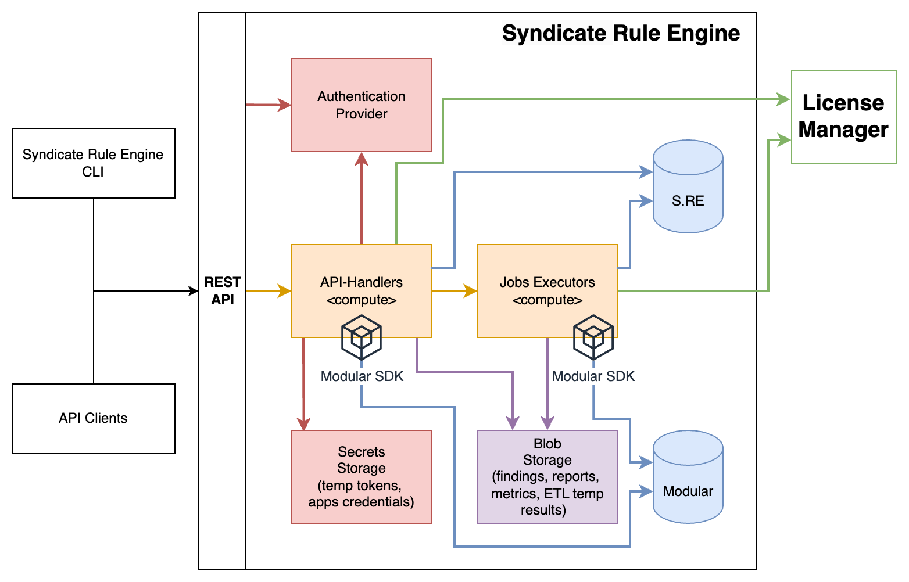

# EPAM Syndicate Rule Engine. Quickstart

## About Syndicate Rule Engine

### What is Syndicate Rule Engine

Syndicate Rule Engine is a service-wrapper, deployable as a set of containers (AWS AMI, Kubernetes Helm chart or Docker Compose), over another opensource tool - [Cloud Custodian](https://cloudcustodian.io/). This quickstart guide is written assuming that you are familiar with it. 

### What does Syndicate Rule Engine do?

Syndicate Rule Engine was created to facilitate the process of scanning an infrastructure by allowing to use pre-defined Cloud Custodian rules from some external repository. 
It allows to manage such repositories, pull rules from them, build rule-sets from the rules according to different criteria, execute scans and generate reports.


## Getting started

- [Architecture](#architecture)
- [Installation](#installation)
- [Configuration](#configuration)
- [Usage](#usage)


## Architecture

### Infrastructure
The API of the service is a Bottle application served by gunicorn. Scans and background tasks are executed by Celery workers, periodic tasks are triggered by Celery beat. MongoDB is the primary database, S3-compatible storage keeps reports and rulesets, Vault keeps secrets and Valkey serves as a Celery broker and cache. Here is a superficial diagram:



Detailed info with diagrams inside the [docs](./docs) folder: [architecture](./docs/architecture.md), [data flows](./docs/data_flows.md).

### Core data classes

All the core models can be split into two parts:

- Modular SDK models - all the models that are inherited from Modular SDK;
(Detailed info with diagrams there: [Modular SDK Documentation](https://github.com/epam/modular-sdk/blob/main/README.md))
- Syndicate Rule Engine specific models;

#### Modular SDK models

##### Customers

Customer is a top-level entity. It bounds all the sub-models to one logical client of the service. It can be, for example, `EPAM`. 

##### Tenants

Each tenant represents one account on any cloud infrastructure. Syndicate Rule Engine currently supports `AWS`, `AZURE` and `GOOGLE` tenants (Kubernetes clusters are registered separately as platforms, see [Kubernetes](#kubernetes)):

- **AWS** account_id
  Represents one AWS account;

- **AZURE** subscription_id
  Represents one Azure subscription (do not confuse with Azure native tenants)

- **GOOGLE** project_id
  Represents one Google project;

##### TenantSettings

Auxiliary model, can contain some settings specific for certain tenants. Inherited from Modular SDK models, from the `Syndicate Rule Engine` side it is used to keep excluded rules for some tenants.

##### Applications

Applications represent access to external services and accounts. Actual sensitive data (passwords, secret keys, certificates) are stored in the secrets storage (Vault). 
Applications can contain names of secrets, api links if necessary and other data required to access an external service. Each application is bound to one customer.

Syndicate Rule Engine uses applications to:

- Retrieve credentials with access (read) to client's accounts;
- Keep license keys for individual Customer (it's explained more verbosely in the [Usage](#usage) section)

##### Parents

A parent is a kind of intermediate (connection) between tenants and applications. One parent can have only one bound application, whereas one tenant can have multiple bound parents. Parent, for example, can connect a set of tenants to some application (all within one customer). Generally, parents can bear some business logic and imply it to tenants. 

Now some concrete case: imagine we have a customer which has its own AWS Organization with N accounts. To be able to scan all these accounts using Syndicate Rule Engine we must: 

1. Create our tenant per each account;
2. Create an application with AWS Organization credentials (that have read access to all the accounts);
3. Bound the application to some subset of tenants or to all the tenants;

Of course, you can create an application per each tenant with its own credentials, if you want. More or less the same logic can be applied to Azure subscriptions and Google projects.

In terms of Syndicate Rule Engine, parents can additionally be used to keep excluded rules (as well as tenant settings). Also, parents can declare whether some tenants must be scanned (this information is used only by Maestro).

Detailed info about Tenant/Parent/Application model: [Modular SDK Documentation](https://github.com/epam/modular-sdk/blob/main/README.md)

#### Syndicate Rule Engine native models

##### SREEvents

Registry of events received for event-driven scans (see [Event-driven scans](#event-driven-scans)).

##### SREJobs

Scan jobs: status, tenant, regions, rulesets, timestamps.

##### SREReportMetrics

Pre-calculated metrics that are used to build reports.

##### SREPolicies

RBAC policies - sets of permissions.

##### SREReportStatistics

Statistics of generated reports.

##### SREResources

Inventory of cloud resources collected by the resource collector.

##### SREResourceExceptions

Resources that are excluded (muted) from reports.

##### SRERetries

Retry attempts of jobs.

##### SRERoles

RBAC roles - sets of policies that are assigned to users.

##### SRERules

Metadata of rules pulled from rule sources.

##### SRERuleSources

Git-based sources (GitHub, GitLab, GitHub releases) from which rules are pulled.

##### SRERulesets

Rulesets: sets of rules assembled for scanning (own or licensed).

##### SREScheduledJobs

Jobs that are executed periodically according to a schedule.

##### SRESettings

Service-wide settings.

##### SREUsers

Users of the service.

What you should understand is that SRE was designed as a Maestro3 pluggable service. That is why it uses Modular SDK models under hood (which are basically maestro models). 
So, all the customers and tenants are supposed to be managed (created, deleted) by Maestro and not by SRE itself. SRE should be installed near Maestro and then just use its existing customers and tenants to scan them. 

Of course, SRE can be a standalone installation without a need to have Maestro (see [Configuration](#configuration) chapter).

## Installation

Available deployment options:

| Option | Purpose | Documentation |
|--------|---------|---------------|
| **AWS AMI** (Minikube on EC2) | Main deployment flow | [AMI documentation](./deployment/aws-ami/docs/main.md), [user guide](./docs/sre_user_guide.md) |
| **Kubernetes Helm** | Custom deployments | [Helm chart](./deployment/helm/README.md) |
| **Docker Compose** | Evaluation / development purposes | [Compose](./deployment/compose/README.md) (`make compose-up`) |

## Configuration

### Initialization

All the deployment options above run the initial configuration automatically on the first start of the `rule-engine` container (see `src/entrypoint.sh`). It consists of the following steps, which you can also execute manually (from the `src` folder) when running the service locally:

```bash
python main.py create-buckets  # creates buckets in MinIO
python main.py create-indexes  # creates MongoDB indexes
python main.py init-vault      # enables the secrets engine and generates a private key in Vault
python main.py init            # sets the system customer name and creates the system user
python main.py run             # runs the API server
```

The environment variables are described in [.env.example](./.env.example) (`SRE_*`, `MODULAR_SDK_*`, `VALKEY_*`). If `SRE_SYSTEM_USER_PASSWORD` is not set, `python main.py init` generates a password for the system user and prints it.

Other `main.py` commands: `set-meta-repos` (sets rules metadata repositories to Vault), `show-permissions`, `generate-openapi`.

### Users, customers and tenants

SRE was designed as a Maestro3 pluggable service, so customers and tenants are managed by Maestro or by Modular Service (`syndicate admin ...`), not by SRE itself. Users of SRE are created via the API/CLI: create a policy, a role that includes the policy, and a user with this role (see User Registration in the [User Guide](./docs/sre_user_guide.md)):

```bash
sre users create --username $YOUR_USER --password $PASSWORD --role_name $ROLE_NAME
```

## Usage

To use the tool you must own an API link and username & password from your user. **Note:** on the AWS AMI the same CLI is available as `syndicate re ...`. You can use the api directly or use the CLI tool. Here we will demonstrate basic CLI actions.


### Swagger UI

The API is self-documented: Swagger UI is available at `<api_link>/doc` (for example, `http://127.0.0.1:8000/re/doc` for a local Docker Compose installation). Endpoint does not require authentication, but the requests sent from the UI do. To try the API from Swagger UI:

1. Get a token right in the UI: expand `POST /signin`, click **Try it out**, fill the request body with your credentials (`{"username": "...", "password": "..."}`) and click **Execute**. Copy the `access_token` value from the response (the token is valid for one hour; `refresh_token` is not needed here).
2. Click **Authorize** and paste the copied token to the `access_token` field (it is sent in the `Authorization` header).
3. Expand any resource, click **Try it out** and **Execute**.

**Note:** the page loads the Swagger UI assets from `unpkg.com`, so your browser needs access to the internet. The specification can also be generated offline with `python main.py generate-openapi` (from the `src` folder).

### Initialization
First, make sure you have `sre` CLI installed:
```bash
$ sre --version
sre, version <xx.yy.zz>
```

Before executing any valuable commands you must configure the tool (specifying a link to the API) and log in using the credentials you've been supplied with. In the case below `$SRE_API_LINK` contains the link to the API, 
`$USERNAME` and `$PASSWORD` contain the username and password accordingly.
```bash
sre configure --api_link $SRE_API_LINK
sre login --username $USERNAME --password $PASSWORD
```
**Note:** login session is one hour long. You will have to log in every sixty minutes.

Execute health check to make sure everything is OK:
```bash
$ sre health_check
```
It checks, among others, the connections to MongoDB, MinIO and Vault, the existence of the buckets, the system customer setting, the Vault auth token and the License Manager integration. Use `--status NOT_OK` to show only failed checks.

### Basics

Now you have your customer and a user, which is connected to this customer, under control! The actions you can perform are defined by the policies and roles attached to your user (for example, the default `admin_policy` and `admin_role`).

Describe your customer by executing the command:
```bash
$ sre customer describe
+------------------+------------------+--------+----------------------------------+
|       Name       |   Display name   | Admins |           Latest login           |
+------------------+------------------+--------+----------------------------------+
| EXAMPLE_CUSTOMER | Example Customer |   —    | Monday, May 15, 2025 03:00:30 PM |
+------------------+------------------+--------+----------------------------------+
```
Describe your tenant:

```bash
$ sre tenant describe
+--------------------+------------------------------------+------------------+-----------+--------------+-------------------------+
|        Name        |          Activation date           |  Customer name   | Is active |   Project    |         Regions         |
+--------------------+------------------------------------+------------------+-----------+--------------+-------------------------+
| EXAMPLE_TENANT_AWS | Tuesday, July 26, 2025 09:50:42 AM | EXAMPLE_CUSTOMER |   True    | 323549576358 | EU-CENTRAL-1, EU-WEST-1 |
+--------------------+------------------------------------+------------------+-----------+--------------+-------------------------+
```

Describe your roles:

```bash
$ sre role describe
+------------+------------------+--------------+-----------------------------------------+
|    Name    |     Customer     |   Policies   |               Expiration                |
+------------+------------------+--------------+-----------------------------------------+
| user_role  | EXAMPLE_CUSTOMER | user_policy  | Saturday, November 11, 2025 01:47:40 PM |
| admin_role | EXAMPLE_CUSTOMER | admin_policy | Saturday, November 11, 2025 01:47:40 PM |
+------------+------------------+--------------+-----------------------------------------+
```
As you are starting to understand on your own, to see the policies use the following command:
```bash
$ sre policy describe --json
```
**Note:** `--json` flag is available everywhere. It forces the output to be shown as a JSON instead of a table. In case of `sre policy describe` the output is too huge and inconvenient for a table.

## Licensed flow

License flow is quite simple. You can receive so-called tenant-license-key from the license manager. Then you just need to add this license on SRE side and execute the job for some tenant. 
The following commands assume that your tenant license key is in env `$TENANT_LICENSE_KEY` and the license under this key allows some AWS ruleset for tenant `EXAMPLE_TENANT_AWS`. 
All the keys or IDs that are used in the tutorial are mocked.

Describe rule-sets and make sure there are none:

```bash
$ sre ruleset describe
+---------------------+
|       Message       |
+---------------------+
| No items to display |
+---------------------+
```

Add the license specifying tenant-license-key:

```bash
$ sre license add --tenant_license_key $TENANT_LICENSE_KEY --json
```

Describe licenses to get the license key (it is not the same as the tenant license key):

```bash
$ sre license describe --json
```

Activate the license for the tenant (each activation overrides the existing one):

```bash
$ sre license activate --license_key $LICENSE_KEY --tenant_name EXAMPLE_TENANT_AWS
```

Use `--all_tenants` (optionally with `--clouds` and `--exclude_tenant`) to activate the license for many tenants at once.

Describe rule-sets to make sure they appear after adding and activating the license:

```bash
$ sre ruleset describe
{
    "trace_id": "a948341f-52e7-44f5-9548-fa8e136154f2",
    "items": [
        {
            "customer": "SRE_SYSTEM",
            "name": "OP_FULL_AWS",
            "version": "1.0",
            "cloud": "AWS",
            "rules_number": 536,
            "active": true,
            "allowed_for": "ALL",
            "license_keys": [
                "bba7a90b-0c4d-4eed-81fc-5653a160bc30"
            ],
            "licensed": true,
            "status": {
                "code": "READY_TO_SCAN",
                "last_update_time": "2025-05-15T13:01:28.932346Z",
                "reason": "Assembled successfully"
            }
        }
    ]
}
```

Execute scan for your tenant:

```bash
$ sre job submit --tenant_name EXAMPLE_TENANT_AWS
+--------------------------------------+-----------+----------------------------------+-----------------------+---------------------+
|                Job id                | Job owner |           Submitted at           | Customer display name | Tenant display name |
+--------------------------------------+-----------+----------------------------------+-----------------------+---------------------+
| 4f3e6d98-1614-45a0-aedc-2f3afd068327 |  example  | Monday, May 15, 2025 04:06:05 PM |   EXAMPLE_CUSTOMER    | EXAMPLE_TENANT_AWS  |
+--------------------------------------+-----------+----------------------------------+-----------------------+---------------------+
```

**Note:** by default, all the rulesets for the tenant's cloud that are allowed by license will be used. All the active regions within the tenant will be used.

You can monitor job status by describing it. In case the job has finished, its status will be `SUCCEEDED`:

```bash
$ sre job describe --limit 1 --json
{
    "trace_id": "01f7ab64-3545-444e-a2fc-8b0341f0eb47",
    "items": [
        {
            "job_id": "4f3e6d98-1614-45a0-aedc-2f3afd068327",
            "job_owner": "example",
            "status": "RUNNING",
            "scan_regions": [
                "eu-central-1",
                "eu-west-1"
            ],
            "scan_rulesets": [
                "OP FULL AWS v1"
            ],
            "submitted_at": "2025-05-15T13:06:05.198827Z",
            "started_at": "2025-05-15T13:06:06.872135Z",
            "stopped_at": null,
            "scheduled_rule_name": null,
            "tenant_display_name": "EXAMPLE_TENANT_AWS"
        }
    ]
}
```

When the job is succeeded, you can generate some reports, for example the most superficial - digests report:

```bash
$ sre report digests jobs -id 4f3e6d98-1614-45a0-aedc-2f3afd068327 --json
{
    "trace_id": "b8868630-df45-48fc-b83e-2eee9b0f8e03",
    "items": [
        {
            "content": {
                "total_checks_performed": 967,
                "successful_checks": 751,
                "failed_checks": 216,
                "total_resources_violated_rules": 3445
            },
            "id": "4f3e6d98-1614-45a0-aedc-2f3afd068327",
            "type": "manual"
        }
    ]
}
```

Compliance report:

```bash
$ sre report compliance jobs -id 4f3e6d98-1614-45a0-aedc-2f3afd068327 --json | head      
{
    "trace_id": "a2eb0dc1-cff9-4669-8eed-203149eee1ee",
    "items": [
        {
            "content": {
                "eu-west-1": {
                    "CMMC v2.0": 31.200396825396826,
                    "ISO 27018_2019": 57.182539682539684,
                    "GDPR 2016_679": 57.55208333333333,
                    "COBIT 19": 20.0,
                    ...
```

Errors report:

```bash
$ sre report errors jobs access -id 4f3e6d98-1614-45a0-aedc-2f3afd068327 --json    
{
    "trace_id": "96413409-146d-48c6-b499-a073ee49fdbb",
    "items": [
        {
            "content": {},
            "id": "4f3e6d98-1614-45a0-aedc-2f3afd068327",
            "type": "manual"
        }
    ]
}
```

Also, you can deactivate or remove the license in case you need:

```bash
$ sre license deactivate --license_key $LICENSE_KEY --tenant_name EXAMPLE_TENANT_AWS
$ sre license delete --license_key $LICENSE_KEY --confirm
```

## Standard flow

`Standard flow` means that you don't use licensed rulesets and create your rule-sets from your rule-sources instead. It's possible but the preferred way to execute scans is by following the `licensed flow`

**Add your own rule-source:**
```bash
$ sre rulesource add --git_project_id $RULE_SOURCE_PROJECT_ID --type GITLAB --git_ref master --git_rules_prefix policies/ --git_url https://git.epam.com --git_access_secret $RULE_SOURCE_SECRET --description "My rules"
```
Supported types: `GITHUB`, `GITLAB`, `GITHUB_RELEASE`.

**Pull rules from the added rule-source:**
```bash
$ sre rulesource sync --rule_source_id $RULE_SOURCE_ID
```
Syncing rules will take some time, you will have to wait a bit. You can see the status of syncing by describing the rule-source. If the status is `SYNCING`, the rule-source is still updating:
```bash
$ sre rulesource describe
```

After the rule-source has been synced you can describe the fetched rules:
```bash
$ sre rule describe --json
```
When the process of syncing has finished, you can assemble rulesets using your own rules.


**Compile some ruleset:**

To create a ruleset use `sre ruleset add` command. Rules can be selected by ids (`--rule`, `--exclude_rule`) or by criteria (`--category`, `--service_section`, `--source`, `--platform` for Kubernetes) from the rule source specified by `--rule_source_id` (or `--git_project_id` with `--git_ref`):
```bash
$ sre ruleset add --name FULL_AWS --version 1.0 --cloud AWS --rule_source_id $RULE_SOURCE_ID --description "All AWS rules"
```
The process of compiling a ruleset is going to take some time. You will have to wait a bit before you can use the ruleset.

**To watch the current status of the assembling process and, incidentally, see all the rulesets, use:**

```bash
$ sre ruleset describe
```

When the status is `READY_TO_SCAN`, the ruleset has been compiled successfully.

**To trigger scan on AWS account, execute:**

Since standard scans don't use licenses, you must specify credentials for the scan (or use `--resolve_local_credentials`):

```bash
sre job submit --tenant_name EXAMPLE_TENANT_AWS --ruleset FULL_AWS --region eu-west-1 \
  --aws_access_key_id $AWS_ACCESS_KEY_ID --aws_secret_access_key $AWS_SECRET_ACCESS_KEY
```

**To watch all the executed jobs and their status use:**

```bash
$ sre job describe --limit 1
```
If the job has finished its status becomes `SUCCEEDED`. Now you can generate reports the same way as for licensed jobs.

To clean up the resources you need to remove ruleset and rule-source:

```bash
$ sre ruleset delete -n FULL_AWS -v 1.0 --confirm
$ sre rulesource delete --rule_source_id $RULE_SOURCE_ID --confirm
```

## Kubernetes

Kubernetes clusters are registered as platforms (`sre platform k8s create|describe|update|delete`). To scan a cluster use:

```bash
$ sre job submit_k8s --platform_id $PLATFORM_ID --ruleset $K8S_RULESET
```

## Event-driven scans

Event-driven scans check only the resources affected by cloud or cluster events (`POST /event` or event sources such as SQS queues and Kubernetes clusters, managed by `sre integrations event sources ...`). See the [README](./README.md#event-driven-scans) and [User Guide](./docs/sre_user_guide.md).
