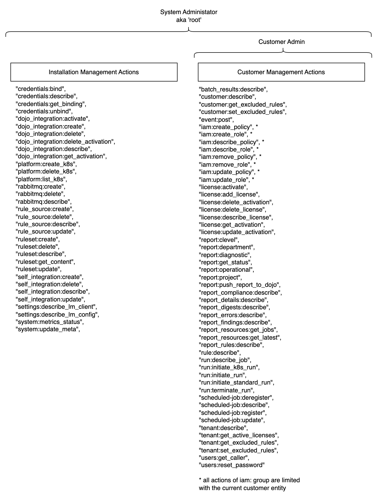

# Access Matrix

Syndicate Rule Engine implements Attribute Based Access Model (ABAC) in order to grant granular access to required resources and actions
for users sticking to the 'least privilege' practice.
Once the Installation is deployed the 'System Administrator' also known as 'root' is available to configure the installation. 
This user is also able to create Customer's - the logically separated workspaces for clients. Once the Customer entity is created
the 'Customer Admin' is created to configure it as required as well as manage it's Identities and Access. It is bound by the Customer workspace 
and can not access other's Customers data. 

To perform a successful request to a specific endpoint three conditions must be satisfied:
1) A user must provide an authentication token
2) The user's role must contain a permission that is required by this endpoint
3) The endpoint must not be a system one. Those are only for system admin. They are always unavailable for standard users

## User Types



## Permissions List
Here is a list of all permissions available in the Syndicate Rule Engine: 
```commandline
"batch_results:describe",
"credentials:bind",
"credentials:describe",
"credentials:get_binding",
"credentials:unbind",
"customer:describe",
"customer:get_excluded_rules",
"customer:set_excluded_rules",
"dojo_integration:activate",
"dojo_integration:create",
"dojo_integration:delete",
"dojo_integration:delete_activation",
"dojo_integration:describe",
"dojo_integration:get_activation",
"event:post",
"iam:create_policy",
"iam:create_role",
"iam:describe_policy",
"iam:describe_role",
"iam:remove_policy",
"iam:remove_role",
"iam:update_policy",
"iam:update_role",
"license:activate",
"license:add_license",
"license:delete_activation",
"license:delete_license",
"license:describe_license",
"license:get_activation",
"license:update_activation",
"platform:create_k8s",
"platform:delete_k8s",
"platform:list_k8s",
"rabbitmq:create",
"rabbitmq:delete",
"rabbitmq:describe",
"report:clevel",
"report:department",
"report:diagnostic",
"report:get_status",
"report:operational",
"report:project",
"report:push_report_to_dojo",
"report_compliance:describe",
"report_details:describe",
"report_digests:describe",
"report_errors:describe",
"report_findings:describe",
"report_resources:get_jobs",
"report_resources:get_latest",
"report_rules:describe",
"rule:describe",
"rule_source:create",
"rule_source:delete",
"rule_source:describe",
"rule_source:update",
"ruleset:create",
"ruleset:delete",
"ruleset:describe",
"ruleset:get_content",
"ruleset:update",
"run:describe_job",
"run:initiate_k8s_run",
"run:initiate_run",
"run:initiate_standard_run",
"run:terminate_run",
"scheduled-job:deregister",
"scheduled-job:describe",
"scheduled-job:register",
"scheduled-job:update",
"self_integration:create",
"self_integration:delete",
"self_integration:describe",
"self_integration:update",
"settings:describe_lm_client",
"settings:describe_lm_config",
"system:metrics_status",
"system:update_meta",
"tenant:describe",
"tenant:get_active_licenses",
"tenant:get_excluded_rules",
"tenant:set_excluded_rules",
"users:get_caller",
"users:reset_password"
```

