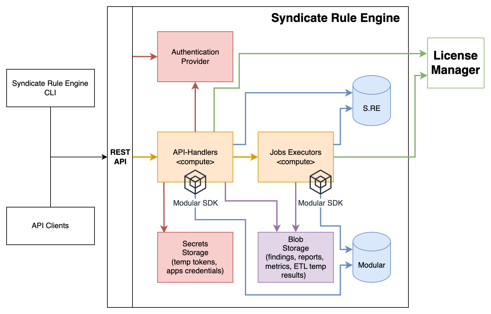
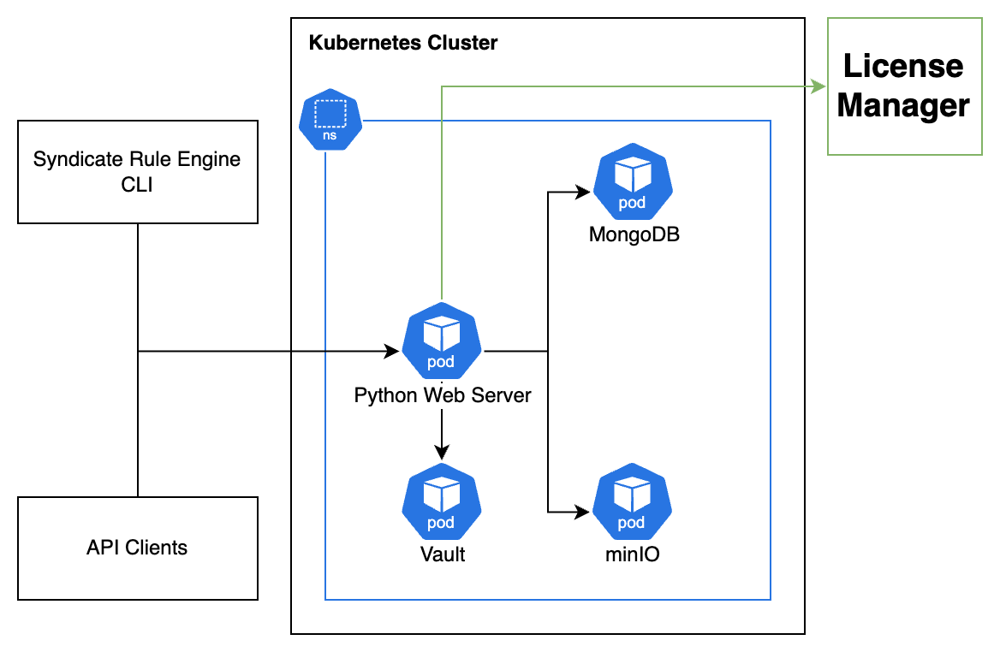

# Architecture Diagrams

## Overall Architecture / Context Diagram

The Overall Architecture Diagram displays the components 
of the Syndicate Rule Engine that brings the solution to life without any specifics of the software or managed services utilized.

## Container-based Architecture Diagram

