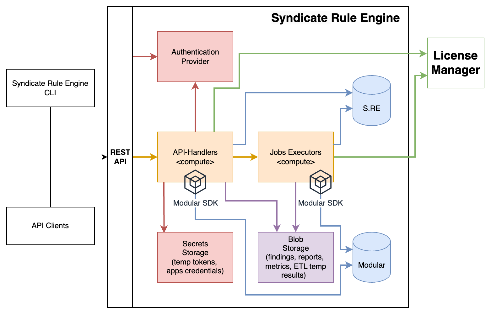
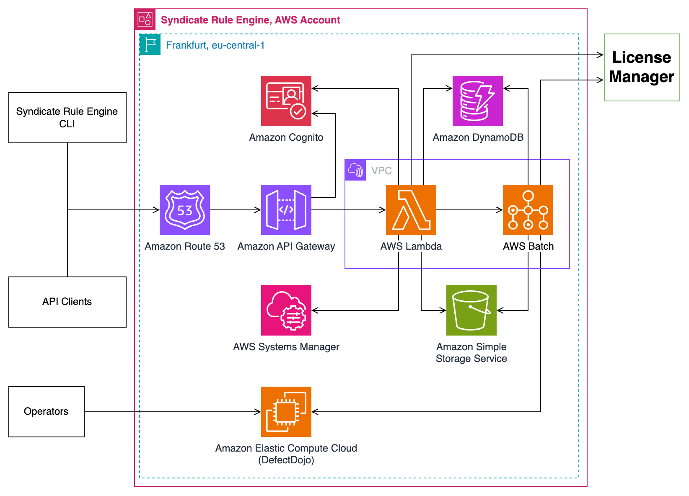

# Architecture Diagrams

## Overall Architecture / Context Diagram

As the solution offers 2 deployment options (AWS Serverless & Container-based one), the Overall Architecture Diagram displays the components 
of the Syndicate Rule Engine that brings the solution to life without any specifics of the software or managed services utilized.

## AWS Architecture Diagram (AWS Serverless) 

## Container-based Architecture Diagram

