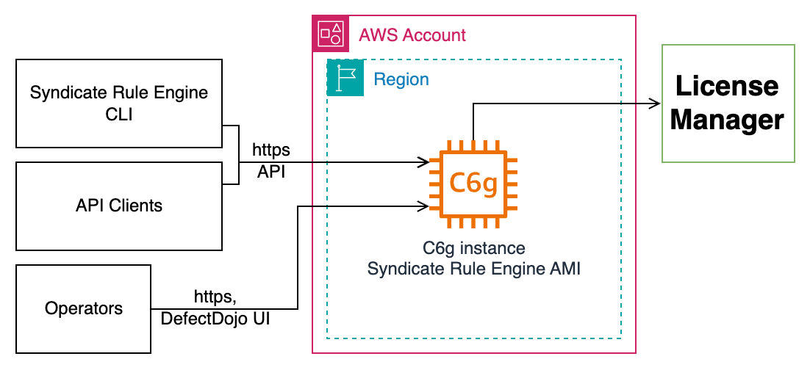

# 1. Introduction

The EPAM Syndicate Rule Engine (also S.RE) is a solution that allows checking and assessing virtual infrastructures in AWS, Microsoft Azure, GCP clouds and Kubernetes clusters against legal, industry, corporate and customer requirements, standards, and best practices rulesets. By default, the solution provides hundreds of security, compliance, utilization, and cost effectiveness rules, which allow users to make sure that their infrastructures match world known standards like GDPR, PCI DSS, CIS Benchmark, and more.

This allows an enterprise to be sure that the environments used for production or development purposes are compliant with the various rules. Meanwhile, it minimizes the challenges like finding proper tools, performing checks in different directions, analyzing findings and quickly reacting, proper remediation planning, ensuring continuous compliance, and maintaining the cost effectiveness and optimization of infrastructure

For existing businesses, it helps inventory and assessment for their legacy infrastructure and planned updates and for new businesses, can help make sure their processes and infrastructure match standards and are effective and safe.

Below, you can find a list of real-life use cases for the product, that illustrate the range of its possibilities.

- **STANDARD COMPLIANCE CHECK**

  **Problem Statement:**  
  An enterprise needs to ensure continuous compliance of their virtual infrastructure with the most referenced security standards.  
  **Solution:**

  Establishing scheduled security checks on AWS, Azure, and GCP environments using EPAM Syndicate Rule Engine and building analytic reports atop the findings.

  Remediation rules and SLAs additionally defined in the corporate policies.

  **Result:**

  The approach to security assessment across the enterprise virtual resources is unified. The vulnerabilities remediation process becomes faster and more effective.

- **FINOPS OPTIMIZATION**

  **Problem Statement:**  
  An enterprise needs to make the FinOps processes more effective and transparent.  
  **Solution:**

  Activating FinOps checks to see the expenses trends and costs control best practices violations.

  **Result:**

  Improved reaction to anomalies and targeted issues remediation allowed got a quick response on the overall enterprise cost.

- **PRE-PRODUCTION ASSESSMENT**

  **Problem Statement:**  
  A new company needs to assess the infrastructure against typical standards before going to production.  
  **Solution:**

  A one-time scan set up on all environments to verify the overall readiness to production.

  A scheduled scan was set to re-assess the infrastructure based on the updates schedule.

  **Result:**

  The initial scan detected a set of critical issues that were fixed timely without exposing the enterprise to major threats.
  Regular check-ups allow to keep to the desired level of compliance in a unified and transparent way.

{{ pagebreak }}

# 2. EPAM Syndicate Rule Engine Deployment

The product is deployed as an AMI provisioned:

- Per request on [EPAM Solutions Hub](https://solutionshub.epam.com/solution/syndicate-rule-engine).

- As an offering on [AWS Marketplace.](https://aws.amazon.com/marketplace/pp/prodview-ps7o6zmsvha6m?applicationId=AWSMPContessa&ref_=beagle&sr=0-2)

Once you obtain the AMI, you need to launch an instance from it and start the product.

The deployment with AMI and necessary post-configuration typically takes up to 30 minutes.

## 2.1 Pre-Requisites

The deployment pre-requisites include technical and skill-based ones.

**Technical pre-requisites:**

- Having an AWS account.

- Having permissions enough to run new EC2 instances.

No other deployment prerequisites are to be met, as the offering is delivered via an AMI.

**User skills requirements:**

To set up EPAM Syndicate Rule Engine and work with it effectively, you need to :

- Have basic EC2 knowledge -- to run an AWS AMI image.

- Have Unix/Linux command line knowledge -- to run the configuration script.

## 2.2 Required Permissions

EPAM Syndicate Rule Engine requires a set of permissions to perform checks on Cloud accounts.

The necessary permissions are listed in the following repos:

- AWS <https://github.com/epam/ecc-aws-rulepack/tree/main/iam>

- AZURE <https://github.com/epam/ecc-azure-rulepack/tree/main/iam>

- GOOGLE <https://github.com/epam/ecc-gcp-rulepack/blob/main/iam/iam.tf>

## 2.3 Components Overview

The Architecture diagram below provides the view on the main components of the offering, provisioned within the AMI:

**Reference Diagram**


##### *Figure 1 - Reference Diagram*

**Containers Diagram using AMI on EC2**



##### *Figure 2 - Containers Diagram*

## 2.4 Deployed Environment Configuration and Resources

During the product deployment, a set of AWS and System resources are created.

**AWS resources:**

The AMI-based deployment relies on an instance with the following minimum configuration:

- OS: Ubuntu (Canonical, Ubuntu, 22.04 LTS, amd64 jammy image)

- vCPU: 2

- RAM: 8 GB

- Disk: 30 GB, at least GP3 3000 IOPS

The provisioned AMI is available across all AWS regions.

These parameters can be used for estimating cost of the solution in a specific deployment region.

**System Resources:**

During the deployment, several secrets are generated. They all belong to the Linux user with ID 1000 and are stored in the /usr/local/sre/secrets/ directory. No one else has read permission to this folder.

The list of these files is given in the Annex 1.

**Customer Sensitive Data**

Customer's secrets if they exist are stored inside Vault. Vault has a docker volume attached.

Customer's scans results data is stored inside Minio bucket `custodian-reports`.

{{ pagebreak }}

# 3. EPAM Syndicate Rule Engine Configuration

After an instance with the EPAM Syndicate Rule Engine is deployed from the provisioned AMI, several steps are to be made to complete the configuration.

- [Initial AMI Instance Launch](#initial-ami-instance-launch) -- the basic login and S.RE start.

- [Initializing AMI for another Linux User](#initializing-ami-for-another-linux-user) -- enabling the S.RE for a new Linux user.

- [User registration](#user-registration) -- registering a new user to enable S.RE performance.

- [Activating Tenants](#user-registration) -- registering tenants (cloud accounts) for compliance checks.

## 3.1 Initial AMI Instance Launch

When AMI is launched and its instance status check is green you can log in to the instance via SSH and use EPAM Syndicate Rule Engine immediately from the syndicate CLI entry point. There are two groups of commands:

- **syndicate re** ... -- used to access scanning and reporting API (*re* stands for "rule engine").

- **syndicate admin** ... -- is used to manage logical entities that represent accounts and organizations (admin - entities administrator).

## 3.2 Initializing AMI for another Linux User

The AMI has a script called **sre-init** that allows to initialize EPAM Syndicate Rule Engine for a new Linux user. By default, only the first non-root linux user has SRE installed. If you want to initialize the S.RE for other Linux users, execute the command:

```console
sre-init --user "username" --public-ssh-key "ssh-..." --re-username job_submitter --re-password $SECRET_PASSWORD
```

A user with name **username** will be created if it does not exist yet. If **--public-ssh-key** is specified, it will be added to ~/.ssh/authorized_keys of that user. You can also provide **--re-username** & **--re-password** of an S.RE user created before to set these credentials.

## 3.3 User Registration

A user is needed for the EPAM Syndicate Rule Engine to perform. Before creating one, it is necessary create a separate policy and role for him.

**1. Create a policy:**

```console
syndicate re policy add --name run_scan_for_all_tenants --permission "job:post_for_tenant" --effect allow --description "Allows to submit jobs for all tenants"
```

> **Note:** the list of all permissions can be found in Annex 2.2

**2. Create a role:**

```console
syndicate re role add --name run_scans_role --policies run_scan_for_all_tenants --description "Allows only to submit jobs"
```

**3. Create a user:**

```console
syndicate re users create --username job_submitter --password $SECRET_PASSWORD --role_name run_scans_role
```

Now you can **log in as the newly created user** or give its credentials to someone else:

```console
syndicate re login --username job_submitter --password $SECRET_PASSWORD
syndicate re job describe
```

**Policies can be added and removed** from roles with the following command:

```console
syndicate re role update --name run_scans_role --attach_policy admin_policy --detach_policy run_scan_for_all_tenants
```

## 3.4 Activating Tenants

A tenant is a main entity that EPAM Syndicate Rule Engine manages and requires. One tenant represents one AWS Account or AZURE subscription or GOOGLE project that is to be scanned. If you want to scan something you must create a tenant that represents it.

When an instance is launched from AMI one tenant is created automatically. Its default name is CURRENT_ACCOUNT and it represents the AWS account where the AMI was launched. This tenant has one active region (the one where instance is launched). In case instance profile allowed READ access to the AWS account that tenant can be immediately used.

### 3.4.1 Activating Tenants linked to cloud accounts

If you want to scan an account other than the one where the EPAM Syndicate Rule Engine instance is launched, you must do the next configuration steps:

**1. Create a tenant entity that represents the account you want to scan:**

```console
syndicate admin tenant create --name "MY_OTHER_ACCOUNT" --display_name "Dev account" --cloud AWS --account_id 111111111111 --primary_contacts admin@example.com --secondary_contacts admin@example.com --tenant_manager_contacts admin@exampl.com --default_owner <admin@example.com>
```

**2. Activate necessary regions for the tenant:**

```console
syndicate admin tenant regions activate --tenant_name MY_OTHER_ACCOUNT --region_name eu-west-1
syndicate admin tenant regions activate --tenant_name MY_OTHER_ACCOUNT --region_name eu-central-1
```

**3. Configure AWS access keys or access role for that specific tenant.**

> **Note:** Access keys can be provided individually for each scan which is definitely the case, but it's somewhat inconvenient:

```console
syndicate admin application create_aws_credentials --access_key $AWS_ACCESS_KEY_ID --secret_key $AWS_SECRET_ACCESS_KEY --session_token $AWS_SESSION_TOKEN --description
```

You can configure an AWS role or, for instance, AZURE Certificate to be used for scanning multiple times. To do this, you must create a so-called Application entity and then bound it to some tenants. Let's take a look at an AWS Role example.


```console
syndicate admin application create_aws_role --role_name rule-engine-scanner --account_id 111111111111 --description "Generic role for AWS tenants"
```

**4. Link the application to ALL the tenants**

```console
syndicate re tenant credentials link --application_id <application id received from command above> --all_tenants
```

Now, if you submit a scan for any tenant within the customer S.RE will try to use that rule-engine-scanner AWS Role. Account ID is generic so, 111111111111 is just the default value. Tenant's account id will be used dynamically, i.e. arn:aws:iam::123123123123:role/rule-engine-scanner for tenant with account id 123123123123 and so on. The save way one Application with AZURE Certificate can be linked to multiple AZURE tenants (remember, one tenant is one subscription)

### 3.4.2 Creating API Users

When the AMI is launched, Admin users are created for the EPAM Syndicate Rule Engine and for the Modular Service. They are configured by default. Their passwords are placed to **/usr/local/sre/secrets/rule-engine-pass** and **/usr/local/sre/secrets/modular-service-pass** correspondingly (all the sensitive information is listed in Annex 1. Username **customer_admin** is default for both and can be configured via User data script before instance startup.

Your admin S.RE user has rights to manage other users inside your customer:

```console
syndicate re users describe
```

Each user has an assigned role. Each role can have multiple policies attached. Each policy can allow or deny specific actions over API, so you can flexibly configure access to the system

## 3.5 License Management

A license is a logical entity that issues rule-sets for scanning.

Each customer can have a license assigned to it and therefore a unique list of allowed rulesets. Licenses are issued by EPAM Syndicate License Manager.

Each AMI-based instance will have a single license which can give multiple rule-sets. You can add more licenses to the installation if you have license keys. Those can be issued by the Syndicate License Manager team. Let's assume you have one and want to add it to the installation.

**1. Add a license:**

```console
syndicate re license add --tenant_license_key $TENANT_LICENSE_KEY --description "my newly provided license"
```

**2. Activate the license for tenants.** You must do that because you can have overlap (two different licenses can issue different rulesets for the same tenant):

```console
syndicate re license activate --license_key <License key from previous command> --tenant_name CURRENT_ACCOUNT --tenant_name ANOTHER_ACCOUNT
```

> **Note:** License Key from the previous command is not the same as $TENANT_LICENSE_KEY

To prolong, update, or cancel an existing license, please contact the support team.

The overview of available plans and prices are given in Annex 3.

{{ pagebreak }}

# 4. Product Maintenance and Support

EPAM Syndicate Rule Engine includes a set of tools, checks and services that enable effective maintenance and support:

- [Product Health Check](#product-health-check) -- the check of the main components status.

- [Product Troubleshooting](#product-troubleshooting) -- the fixes for the typical possible issues.

- [Backup & Recovery](#backup-recovery) -- the recommendations on the backup and recovery approaches.

- [Upgrades and Patches](#upgrades-and-patches) -- the processes of the product updates and patches deployment.

## 4.1 Product Health Check

EPAM Syndicate Rule Engine part has its health check. It makes sure that:

- Minio is available

- Mongo is available

- Vault is available

- necessary buckets exist in Minio

- License Manager private key is configured

- License Manager API link is configured

- system customer setting configured

- S.RE secret key exists in Vault

To perform the health check procedure, run:

```console
syndicate re health_check
```

## 4.2 Product Troubleshooting

The health check procedure can return several statuses that need your attention:

### 4.2.1 Status: **NOT_OK**

Action: Contact the support team

### 4.2.2 Status: Job has finished with status `FAILED`

Action: Describe the job using command below and look at the `reason` field.

```console
syndicate re job describe --job_id $JOB_ID
```

The `reason` can be one of these:

- `**License manager does not allow this job**`: your license has expired or the limit of jobs is exceeded or license manager is temporarily unavailable. Try to submit the job again in a while and if it does not help - contact the support team.

- **`Could not resolve any credentials`**: the executor cannot find cloud credentials to use during the scan. In case you are going to scan the same account where the instance is running you can create an EC2 Instance profile role and attach it to the instance. If you are going to scan another account you can provide temp credentials to CLI commands:

```console
syndicate re job submit ... --access_key $AWS_ACCESS_KEY_ID --secret_key $AWS_SECRET_ACCESS_KEY --session_token $AWS_SESSION_TOKEN
``` 
> **Note:** Also, you can configure AWS role, etc. using `syndicate admin` commands.

- `**Internal executor error**`: the executor failed with internal reason. Contact the support team

### 4.2.3 Status: Cannot submit job

If the `syndicate re job submit` commands returns:

- **`Tenant could not be granted to start a licensed job with tenant license`**: our license manager does not allow to submit the license. Either you jobs limit per period was exceeded or LM is temporarily unavailable. Try again in a while.

- **`There are no linked licenses for this tenant`**: your license is probably expired or invalid and was removed when license synchronization happened. Contact the support team.

- **`No appropriate licensed rulesets found for the requests scan`**: try not specifying `--ruleset` for `syndicate re job submit`. Or specify the valid ruleset name, retrieved from `syndicate re ruleset describe`

### 4.2.4 Status: Cannot execute any command because token has expired

If `syndicate ...` any command returns `**The provided token has expired. Please re-login to get a new token**` try the following:

```console
syndicate login
```

## 4.3 Backup & Recovery

The main backup strategy for the product is using an AMI Snapshot. You can either use the initial AMI provisioned for the product deployment, or create a custom snapshot using standard AWS tools

For tenant data export, it is recommended to arrange backup to an external storage.

Also, you can export docker volumes: `vault-data`, `mongo-data`, `minio-data`, `defectdojo_data`, `defectdojo_postgres`, `defectdojo_media`, `defectdojo_redis`

## 4.4 Upgrades and Patches

The upgrades and patches for the product are delivered within updated AMIs and changes on GitHub.

The components upgrade and patches application logic is in-built into the solution. To initiate components update and data patching, you need to authenticate to the host instance using SSH and admin user and execute the following command:

```console
sre-init
```

The update can take from several minutes up to one hour, depending on the amount of changes and data. The process needs service downtime.

{{ pagebreak }}

# 5. Security Highlights

EPAM Syndicate Rule Engine security includes the following keystone approaches:

- [Rotating Keys & Credentials](#rotating-keys-credentials)

- [Policies and Privileges](#policies-and-privileges)

- [Data Encryption](#data-encryption)

Below, the details on each part is given.

## 5.1 Rotating Keys & Credentials

The following tools and approaches are applied for keys rotation within the solution:

- **Rotate your S.RE user's password**:

```console
syndicate re whoami # returns the current user. You should be logged in.
syndicate re users change_password --password $NEW_PASSWORD
syndicate re login --username $USERNAME --password $NEW_PASSWORD
```

- **Rotate your Modular Service user's password:**

```console
syndicate admin users change_password --password $NEW_PASSWORD
syndicate admin login --username $USERNAME --password $NEW_PASSWORD
```

- **Rotate your Modular API password (experimental, only for `sudo` user)**

```console
sudo docker exec modular-api python modular.py user change_password --username $MODULAR_API_USER --password $NEW_PASSWORD
syndicate setup --username $MODULAR_API_USER --password $NEW_PASSWORD --api_path http://127.0.0.1:8085 # re-login
```

**The keys for the following components are automatically generated** at the service start, and stored on the OS level, preserving the security of the OS users access**:

- Vault, Mongo, Minio credentials

- Defect Dojo credentials and secret keys

- S.RE Secret keys

## 5.2 Policies and Privileges

The following approaches for policies and privileges on your AWS account are highly recommended to ensure the infrastructure security:

- The product does not need AWS root account privileges.

- Do not use AWS account root user for any deployment or operations.

- The principle of least privilege is an option of choice when it comes to access granted within the deployment.

> **Note:** EPAM Syndicate Rule Engine needs [extended FULL READ ONLY access](#aws-iam-permissions-required-to-scan-aws-infrastructure) to AWS Services in order to perform scanning. Do not use AWS-managed [ReadOnlyAccess IAM policy](https://docs.aws.amazon.com/aws-managed-policy/latest/reference/ReadOnlyAccess.html), as it is not sufficient to complete the scan.

- There are no public resources except the License Manager and accounts that are to be scanned.

- Instance metadata V2 is used during setup to retrieve instance identity document and its signature

## 5.3 Data Encryption

EPAM Syndicate Rule Engine follows these encryption approaches:

- All communication between docker containers is NOT encrypted (http).

- Communication with the S.RE License Manager is encrypted.

- There is no persistent encryption for Minio and Mongo.

- Vault is sealed when the instance is stopped and unsealed when it's started.

{{ pagebreak }}

# 6. Scanning and Reporting

The main tool for EPAM Syndicate Rule Engine usage is the CLI.

Further in this section, you can find the instructions on specific actions that can be performed with the tool:

- [Quick Start](#quick-start) -- basic steps to perform your first scans.

- [Requesting a Full Scan](#requesting-a-full-scan) -- requesting a scan for all available regions and rulesets.

- [Requesting Scan by Specific Rules](#requesting-scan-by-specific-rules) -- requesting a scan by specific rules available within the S.RE.

- [Disabling Rules for a Tenant](#disabling-rules-for-a-tenant) -- setting exclusions for the rules within a tenant.

- [Receiving Reports](#receiving-reports) -- getting the results of the performed scans.

## 6.1 Quick Start

When AMI instance is running you **can log in using ssh and immediately use EPAM Syndicate Rule Engine**.

```console
ssh -i "private-key.pem" admin@domain.compute.amazonaws.com
syndicate version
```

**Syndicate** is the main CLI entry point that you should use to interact with S.RE API and Modular Service API. S.RE API allows to execute scans and receive reports. Modular Service - is an admin API. It allows to configure such organization entities as Customers and Tenants. Use commands syndicate re and syndicate admin accordingly.

- Both S.RE API and Modular Service API have authentication mechanism and credentials to access them. Those were set for you during setup and their refresh tokens are updated automatically when session ends. syndicate tool also has its authentication mechanism, and it may require to log in once in a while. So, if any **syndicate ... command tells that session has ended, use this command**:

```console
syndicate login
```

> **Note:** credentials are stored here ~/.modular_cli/.

- From the beginning, only entity that represents the AWS account where instance is running - is activated. Such entities are called Tenants. You can **describe tenants** using this command:

```console
syndicate re tenant describe
```

> **Note:** this one by default has CURRENT_ACCOUNT name that must be used to reference this entity.

- When the instance was starting, it made a request to our License Manager and received a license and rule-sets. You can **describe the license** using this command:

```console
syndicate re license describe
```

- Command to **describe available rulesets**:

```console
syndicate re ruleset describe
```

- Command to **describe available rules**:

```console
syndicate re ruleset describe --get_rules
```

- If the instance has Instance Role with access to this AWS Account you can **execute scans immediately** without further configuration. Use this command:

```console
syndicate re job submit --tenant_name CURRENT_ACCOUNT --region eu-west-1 # or the region you want
```

- S.RE will use rulesets that are available by license and credentials from instance profile.

**To see the job status** use:

```console
syndicate re job describe --limit 1
```

- When the status is SUCCEEDED you can **request some reports**:

```console
syndicate re report digests jobs --job_id <job_id> --json
syndicate re report resource latest --tenant_name CURRENT_ACCOUNT --json > data.json
```

See the full documentation for further details.

## 6.2 Requesting a Full Scan

To **request a scan** for a CURRENT_ACCOUNT tenant for all regions and all rules, run the following command:

```console
syndicate re job submit --tenant_name CURRENT_ACCOUNT --region eu-west-1
```

To **see the status of the submitted job**, use the describe command:

```console
syndicate re job describe --job_id <job id from submit command>
```

## 6.3 Requesting Scan by Specific Rules

You can use rule-sets names to scan only those in case the license provides multiple rulesets for one cloud.

**To find available rule sets**, run:

```console
syndicate re ruleset describe
```

**To find available rules**:

```console
syndicate re ruleset describe --get_rules
```

**To start the scan**:

```console
syndicate re job submit --tenant_name CURRENT_ACCOUNT --ruleset FULL_AWS --region eu-west-1
```

Also, you can restrict the scope to specific rule names.

```console
syndicate re job submit --tenant_name CURRENT_ACCOUNT --ruleset FULL_AWS --rules_to_scan ecc-aws-001... --rules_to_scann ecc-aws-002...
```

List of all rules and their descriptions can be found in product:

- AWS <https://github.com/epam/ecc-aws-rulepack/tree/main/iam>

- AZURE <https://github.com/epam/ecc-azure-rulepack/tree/main/iam>

- GOOGLE <https://github.com/epam/ecc-gcp-rulepack/blob/main/iam/iam.tf>

## 6.4 Disabling Rules for a Tenant

You can exclude some rules for specific tenant or for the whole customer if you know that you won't need those although the ruleset has them.

**To find available rules**:

```console
syndicate re ruleset describe --get_rules
```

**Exclude for tenant**:

```console
syndicate re tenant set_excluded_rules --tenant_name CURRENT_ACCOUNT --rules ecc-aws-001 --rules ecc-aws-002
```

**Exclude for customer:**

```console
syndicate re customer set_excluded_rules --rules ecc-aws-003
```

## 6.5 Receiving Reports

Generally, all reports can be divided into two parts: **job-scope reports** and **tenant-scope reports**.

As the name implies, **job-scope reports** will show information about a specific job independently of others. **Tenant-scope reports** will contain data accumulated from multiple jobs within a tenant.

All the reports can be accessed from **syndicate re report** entry point:

- To get the latest resources state for a tenant you can generate resources report:

```console
syndicate re report resource latest --tenant_name CURRENT_ACCOUNT --json > data.json
```

- To get the report in a convenient format, use --format xlsx and download the file from the received url:

```console
syndicate re report resource latest --tenant_name CURRENT_ACCOUNT --format xlsx --json
```

- To get the same report but filtered based on some attributes, use the respective CLI parameters:

```console
syndicate re report resource latest --tenant_name CURRENT_ACCOUNT --format xlsx --region eu-central-1 --name my-lambda --json
```

- If you want to look at Access Denied errors during the scan you can generate errors report:

```console
syndicate re report errors jobs --job_id d9db86d6-a8fb-4383-8204-14961a90b8d4 --error_type ACCESS
```

When the AMI-based instance is running, you can access **Defect Dojo UI** on the 8080 port of instance public IPv4. The Admin password is inside the **/usr/local/sre/secrets/defect-dojo-pass** file. Admin username is admin. S.RE is configured to push results of each job automatically, so you should see active findings after at least one job was successfully finished.

{{ pagebreak }}

# 7. Support

EPAM Syndicate Rule Engine support team is available by <SupportSyndicateTeam@epam.com> email.

Please address all your questions and we will respond within 3 business day (Ukraine schedule)

Within the Professional Service offering, the customer gets a dedicated expert, who:

- Assists with performing assessment using the S.RE tool.

- Performs tool configuration and rule sets management by customer's request.

- Performs as the Tech Support entry point.

- Suggests Syndicate toolset expansion, based on the declared customer needs.

{{ pagebreak }}

# Annex

## 1. Secrets Inside AMI

All the secrets that are generated during installation belong to the linux user with id 1000. They are inside /usr/local/sre/secrets/. There are these files:

- **defect-dojo-pass**: Defect Dojo admin password

- **modular-service-pass**: Modular service admin user password

- **rule-engine-pass**: S.RE admin user password

- **rule-engine.env**: S.RE environment variables generated before starting the server. It contains credentials to microservices (mongo, minio and vault) and system password for S.RE and Modular Service

- **defect-dojo.env**: Defect Dojo environment variables generated before starting the server

- **lm-link**: Syndicate License Manager API link

- **lm-response**: Syndicate License Manager API response. It contains tenant license key and private keys to sign requests

## 2. Permissions

Permission model is aligned with the API available for managing the system. This API includes the following groups:

- [A set of points related to diagnostics](#diagnostics) (refresh and health, batch result, jobs)

- [Credentials management & user authorization](#credentials-management-user-authorization) (credentials, sign in, sign up)

- [Customer management & license information](#customer-management-license-information) (customer, tenant, setting; license)

- [API necessary for Integration with third-party systems](#api-necessary-for-integration-with-third-party-systems)

- [Rules and rule sets meta information management](#rules-and-rule-sets-meta-information-management)

- [Report-oriented API methods](#report-oriented-api-methods)

### Diagnostics

| **Endpoint** | **Permission** | **Description** |
|--------------|----------------|-----------------|
| POST /refresh | - | Allows to refresh the access token |
| GET /health | - | Performs all available health checks |
| GET /health/{id} | - | Performs a specific health check by its id |
| GET /batch-results/{batch_results_id} | batch_results:get | Allows to get a specific event-driven job by id |
| GET /batch-results | batch_results:query | Allows to query event driven jobs |
| POST /event | event:post | Receives event-driven events |
| GET /jobs/{job_id} | job:get | Allows to get a specific job by id |
| POST /jobs/k8s | job:post_for_k8s_platform | Allows to submit a licensed job for a K8S cluster |
| POST /jobs | job:post_for_tenant | Allows to submit a licensed job for a cloud |
| POST /jobs/standard | job:post_for_tenant_standard | Allows to submit a standard not licensed job. Ruleset must be present locally |
| GET /jobs | job:query | Allows to query jobs |
| DELETE /jobs/{job_id} | job:terminate | Allows to terminate a job that is running |
| DELETE /scheduled-job/{name} | scheduled-job:deregister | Allows to deregister a scheduled job |
| GET /scheduled-job/{name} | scheduled-job:get | Allows to get a registered scheduled job by its name |
| GET /scheduled-job | scheduled-job:query | Allows to query registered scheduled jobs |
| POST /scheduled-job | scheduled-job:register | Allows to register a scheduled job |
| PATCH /scheduled-job/{name} | scheduled-job:update | Allows to update a registered scheduled job by name |
| GET /metrics/status | system:metrics_status | Allows to get latest metrics update status |
| POST /metrics/update | system:update_metrics | Allows to submit a job that will update metrics |

### Credentials management & user authorization

| **Endpoint** | **Permission** | **Description** |
|--------------|----------------|-----------------|
| POST /signup | - | Registers a new API user, creates a new customer and admin role for that user |
| POST /signin | - | Allows log in and receive access and refresh tokens |
| PUT /credentials/{id}/binding | credentials:bind | Allows to link tenants to a specific credentials configuration |
| GET /credentials | credentials:describe | Allows to get credentials configurations within a customer |
| GET /credentials/{id} | credentials:describe | Allows to get a credentials configuration by id |
| GET /credentials/{id}/binding | credentials:get_binding | Allows to show tenants that are linked to specific credentials configuration |
| DELETE /credentials/{id}/binding | credentials:unbind | Allows to unlink a specific credentials configuration from all tenants |
| PUT /credentials/{id}/binding | credentials:bind | Allows to link tenants to a specific credentials configuration |
| GET /credentials | credentials:describe | Allows to get credentials configurations within a customer |
| GET /credentials/{id} | credentials:describe | Allows to get a credentials configuration by id |
| GET /credentials/{id}/binding | credentials:get_binding | Allows to show tenants that are linked to specific credentials configuration |
| DELETE /credentials/{id}/binding | credentials:unbind | Allows to unlink a specific credentials configuration from all tenants |
| POST /policies | iam:create_policy | Allows to create a policy |
| POST /roles | iam:create_role | Allows to create a role |
| GET /policies | iam:describe_policy | Allows to list rbac policies |
| GET /policies/{name} | iam:describe_policy | Allows to get a policy by name |
| GET /roles | iam:describe_role | Allows to list rbac roles |
| GET /roles/{name} | iam:describe_role | Allows to get a role by name |
| DELETE /policies/{name} | iam:remove_policy | Allows to delete a policy by name |
| DELETE /roles/{name} | iam:remove_role | Allows to delete a role by name |
| PATCH /policies/{name} | iam:update_policy | Allows to update a policy name |
| PATCH /roles/{name} | iam:update_role | Allows to update a role by name |
| POST /users | users:create | Allows to create a new API user |
| DELETE /users/{username} | users:delete | Allows to delete a specific user |
| GET /users/{username} | users:describe | Allows to get an API user by name |
| GET /users | users:describe | Allows to list API users |
| GET /users/whoami | users:get_caller | Allows to describe the user making this call |
| POST /users/reset-password | users:reset_password | Allows to change you password |
| PATCH /users/{username} | users:update | Allows to update a specific user |

### Customer management & license information

| **Endpoint** | **Permission** | **Description** |
|--------------|----------------|-----------------|
| GET /customers | customer:describe | Allows to describe customers |
| GET /customers/excluded-rules | customer:get_excluded_rules | Allows to get customer`s excluded rules |
| PUT /customers/excluded-rules | customer:set_excluded_rules | Allows to exclude rules for customer |
| PUT /licenses/{license_key}/activation | license:activate | Allows to activate a specific license for some tenants |
| POST /licenses | license:add_license | Allows to add a license from LM by tenant license key |
| DELETE /licenses/{license_key}/activation | license:delete_activation | Allows to deactivate a specific license |
| DELETE /licenses/{license_key} | license:delete_license | Allows to delete a specific license |
| GET /licenses/{license_key} | license:get | Allows to describe a specific license by license key |
| GET /licenses/{license_key}/activation | license:get_activation | Allows to list tenants a license is activated for |
| GET /licenses | license:query | Allows to list locally added licenses |
| POST /licenses/{license_key}/sync | license:sync | Allows to trigger license sync |
| PATCH /licenses/{license_key}/activation | license:update_activation | Allows to update tenants the license is activated for |
| POST /customers/rabbitmq | rabbitmq:create | Allows to create a RabbitMQ configuration for customer |
| DELETE /customers/rabbitmq | rabbitmq:delete | Allows to remove a RabbitMQ configuration |
| GET /customers/rabbitmq | rabbitmq:describe | Allows to describe RabbitMQ configuration |
| POST /settings/send_reports | settings:change_send_reports | Allows to enable or disable high-level reports sending |
| POST /settings/license-manager/client | settings:create_lm_client | Allows to add license manager client |
| POST /settings/license-manager/config | settings:create_lm_config | Allows to set license manager configuration |
| POST /settings/mail | settings:create_mail | Allows to set mail configuration |
| DELETE /settings/license-manager/client | settings:delete_lm_client | Allows to delete license manager client |
| DELETE /settings/license-manager/config | settings:delete_lm_config | Allows to delete license manager configuration |
| DELETE /settings/mail | settings:delete_mail | Allows to delete mail configuration |
| GET /settings/license-manager/client | settings:describe_lm_client | Allows to describe license manager client |
| GET /settings/license-manager/config | settings:describe_lm_config | Allows to get license manager configuration |
| GET /settings/mail | settings:describe_mail | Allows to describe mail configuration |
| GET /tenants/{tenant_name} | tenant:get | Allows to get a tenant by name |
| GET /tenants/{tenant_name}/active-licenses | tenant:get_active_licenses | Allows to get licenses that are activated for a specific tenant |
| GET /tenants/{tenant_name}/excluded-rules | tenant:get_excluded_rules | Allows to get rules that are excluded for tenant |
| GET /tenants | tenant:query | Allows to query tenants |
| PUT /tenants/{tenant_name}/excluded-rules | tenant:set_excluded_rules | Allows to exclude rules for tenant |

### API necessary for Integration with third-party systems

| **Endpoint** | **Permission** | **Description** |
|--------------|----------------|-----------------|
| PUT /integrations/defect-dojo/{id}/activation | dojo_integration:activate | Allows to activate Defect Dojo integration for tenants |
| GET /integrations/defect-dojo/{id}/activation | dojo_integration:activate | Allows to get tenants Defect Dojo integration is activated for |
| POST /integrations/defect-dojo | dojo_integration:create | Allows to register Defect Dojo integration |
| DELETE /integrations/defect-dojo/{id} | dojo_integration:delete | Allows to delete Defect Dojo integration by id |
| DELETE /integrations/defect-dojo/{id}/activation | dojo_integration:delete_activation | Allows to deactivate Defect Dojo integration |
| GET /integrations/defect-dojo | dojo_integration:describe | Allows to list registered Defect Dojo integrations |
| GET /integrations/defect-dojo/{id} | dojo_integration:describe | Allows to describe Defect Dojo integration by id |
| POST /platforms/k8s | platform:create_k8s | Allows to register K8S platform |
| DELETE /platforms/k8s/{platform_id} | platform:delete_k8s | Allows to deregister a K8S platform |
| GET /platforms/k8s/{platform_id} | platform:get_k8s | Allows to register K8S platform |
| GET /platforms/k8s | platform:query_k8 | Allows to query registered K8S platforms |
| PUT /integrations/temp/sre | self_integration:create | Allows to create an application with type CUSTODIAN for integration with Maestro |
| DELETE /integrations/temp/sre | self_integration:delete | Allows to delete an integration with Maestro |
| GET /integrations/temp/sre | self_integration:describe | Allows to get integration with Maestro |
| PATCH /integrations/temp/sre | self_integration:update | Allows to change tenants that are active for integrations with Maestro |

### Rules and rule sets meta information management

| **Endpoint** | **Permission** | **Description** |
|--------------|----------------|-----------------|
| POST /rule-meta/mappings | meta:update_mappings | Allows to submit a job to update rules meta mappings |
| POST /rule-meta/meta | meta:update_meta | Allows to submit a job to update rules meta mappings |
| POST /rule-meta/standards | meta:update_standards | Allows to submit a job to update standards meta |
| DELETE /rules | rule:delete | Allows to delete local rules content |
| GET /rules | rule:describe | Allows to describe locally available rules |
| POST /rule-sources | rule_source:create | Allows to add a rule-source locally |
| DELETE /rule-sources | rule_source:delete | Allows to delete a local rule-source |
| GET /rule-sources | rule_source:describe | Allows to list all locally added rule sources |
| PATCH /rule-sources | rule_source:update | Allows to update a local rule-source |
| POST /rulesets | ruleset:create | Allows to create a local ruleset from local rules |
| POST /rulesets/event-driven | ruleset:create_event_driven | Allows to create a ruleset for event-driven scans |
| DELETE /rulesets | ruleset:delete | Allows to delete a local ruleset |
| DELETE /rulesets/event-driven | ruleset:delete_event_driven | Allows to delete a ruleset for event-driven scans |
| GET /rulesets | ruleset:describe | Allows to query available rulesets |
| GET /rulesets/event-driven | ruleset:describe_event_driven | Allows to list rulesets for event-driven scans |
| GET /rulesets/content | ruleset:get_content | Allows to retrieve ruleset content |
| PATCH /rulesets | ruleset:update | Allows to update a local ruleset |
| POST /rules/update-meta | system:update_meta | Allows to submit a job that will pull latest rules content |

### Report-oriented API methods

| **Endpoint** | **Permission** | **Description** |
|--------------|----------------|-----------------|
| GET /reports/details/jobs/{job_id} | report:get_details | Allows to get a detailed report by job id |
| GET /reports/details/tenants/{tenant_name}/jobs | report:get_details | Allows to get multiple detailed reports by tenant latest jobs |
| GET /reports/diagnostic | report:get_diagnostic | Allows to get diagnostic report |
| GET /reports/digests/jobs/{job_id} | report:get_digest | Allows to get a digest report by job id |
| GET /reports/digests/tenants/{tenant_name}/jobs | report:get_digest | Allows to get multiple digest reports by tenant latest jobs |
| GET /reports/findings/jobs/{job_id} | report:get_findings | Allows to get findings by job id |
| GET /reports/findings/tenants/{tenant_name}/jobs | report:get_findings | Allows to get findings by latest jobs of a tenant |
| GET /reports/compliance/jobs/{job_id} | report:get_job_compliance | Allows to get compliance report by a job |
| GET /reports/errors/jobs/{job_id} | report:get_job_errors | Allows to get errors occurred during a job |
| GET /reports/resources/jobs/{job_id} | report:get_job_resources | Allows to get latest resources report by job |
| GET /reports/resources/tenants/{tenant_name}/jobs | report:get_job_resources_batch | Allows to get latest resources report by latest tenant jobs |
| GET /reports/rules/jobs/{job_id} | report:get_job_rules | Allows to get information about rules executed during a job |
| GET /reports/resources/platforms/k8s/{platform_id}/state/latest | report:get_k8s_platform_latest_resources | Allows to get latest resources report by K8S platform |
| GET /reports/status | report:get_status | Allows to get a status of report by id |
| GET /reports/compliance/tenants/{tenant_name} | report:get_tenant_compliance | Allows to get a compliance report by tenant |
| GET /reports/raw/tenants/{tenant_name}/state/latest | report:get_tenant_latest_raw_report | Allows to request raw report data by tenant |
| GET /reports/resources/tenants/{tenant_name}/state/latest | report:get_tenant_latest_resources | Allows to get latest resources report by tenant |
| GET /reports/rules/tenants/{tenant_name} | report:get_tenant_rules | Allows to get average rules data by latest tenant jobs |
| POST /reports/clevel | report:post_clevel | Allows to request clevel report |
| POST /reports/department | report:post_department | Allows to request department report |
| POST /reports/operational | report:post_operational | Allows to request operational report |
| POST /reports/project | report:post_project | Allows to request project report |
| POST /reports/push/dojo/{job_id} | report:push_report_to_dojo | Allows to push a specific job to Defect Dojo |
| POST /reports/push/dojo | report:push_to_dojo_batch | Allows to push multiple jobs to Defect Dojo |

## 3. License Pricing

EPAM Syndicate Rule Engine product is licensed according to the following pricing:

- **Open Source** -- Allows deploying the service on your own and enable security compliance for free using the demo license that includes 60 rules (20 per AWS, Azure, GCP clouds each).

- **Basic Security** -- Best match for Startups who do not have a dedicated Security Expert. Receive regularly updated full set of rules, up to 3 Well-Architected and FinOps reviews monthly.

- **Standard Security** -- Option to have a reliable security support of the software. Receive regularly updated full set of rules, up to 10 Well-Architected and FinOps reviews monthly.

- **Zero Tolerance Security** -- Minimize possible losses related to data leaks and infrastructure backdoors of your critical software components. Receive regularly updated full set of rules, and unlimited Well-Architected and FinOps reviews.

The set of provisioned services and additional features depends on the selected option. Each next level can be considered as an expansion of the previous one.

**PLANS COMPARISON**

| **Features** | **Open Source Free** | **Basic Security $3,000/mon** | **Standard Security $6,400/mon** | **Zero Tolerance Security $14,000/mon** |
|--------------|---------------------|-------------------------------|----------------------------------|----------------------------------------|
| **Professional service hours** | 0 | 24 | 64 | 160 |
| **Minimum commitment month** | - | 3 | 3 | 3 |
| **Rules Available** | Demo Pack (60 rules, 20 per cloud) | All rules available (1150+), regularly updated | | |
| **DefectDojo integration** | + | + | + | + |
| **Well-Acrhitected review** | - | up to 3 accounts | up to 10 accounts | unlimited |
| **FinOps assessment** | - | up to 3 accounts | up to 10 accounts | unlimited |
| **Monthly updates** | - | + | + | + |
| **Service introduction call (45 min)** | - | + | + | + |

**DETAILED PLAN DESCRIPTIONS (SKU)**

| **PLAN NAME (SKU)** | **DESCRIPTION** |
|---------------------|-----------------|
| Open Source (SRE_FREE) | Allows deploying the service on your own and enable security compliance for free. No professional hours, no minimum commitment. Free. |
| Basic Security (SRE_BASIC) | Best match for Startups who do not have a dedicated Security Expert, 24 professional service hours, 3 minimum commitment months, $3000/month* |
| Standard Security (SRE_SMB) | Option to have a reliable security support of the software. 6 professional service hours, 3 minimum commitment months, $6400/month* |
| Zero Tolerance Security (SRE_ENT) | Minimize possible losses related to data leaks and infrastructure backdoors of your critical software components. 160 professional service hours, 3 minimum commitment months, $14000/month* |

*The price is given in USD, taxes not included, the list price, may be changed. You can check for the updates on the product [EPAM Solutions Hub page](https://solutionshub.epam.com/solution/syndicate-rule-engine).

## Table of Figures

[Figure 1 - Reference Diagram](#figure-1---reference-diagram)

[Figure 2 - Containers Diagram](#figure-2---containers-diagram)

## Version History

| **Version** | **Date** | **Summary** |
|-------------|----------|-------------|
| 1.0 | June 2024 | - Initial version created |
| 1.1 | July 2024 | - Minor clarifications introduced across several sections |
| 1.2 | October 2025 | - Minor changes |

[Go to Table of Contents](#table-of-contents)
