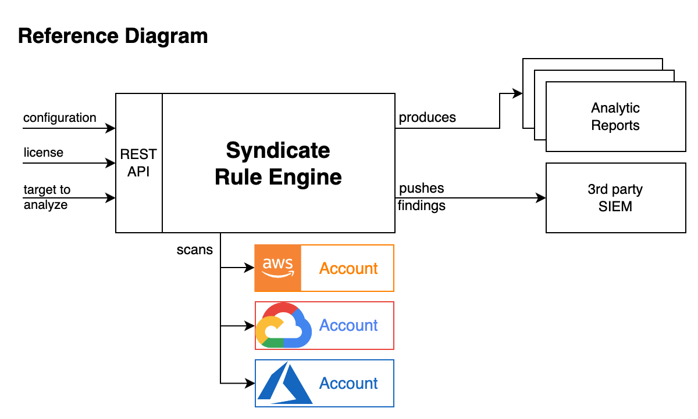

# EPAM Syndicate Rule Engine

EPAM Syndicate Rule Engine is a solution that allows checking and assessing virtual infrastructures in AWS, Azure, GCP infrastructures
against different types of standards, requirements and rulesets. Generally it queries the Cloud Provider's API in order to find out if there are
the resources that violates some rules. 
For example: 
- ec2 instances with port 80 exposed to internet; 
- security group with 0.0.0.0/32 range; 
- certificates that are expired or are about to expire in 10 days.
- Syndicate Rule Engine collects the findings (resources which do violate the rules) and produces the analytic reports according to the license available. 

### License
is a set of features available to the License Owner during set period of time.
The following features are available: 
1. Rulesets - the sets of Rules (* <TBD> see terms definitions in Github Wiki) that are assembled to cover typical need of the customers like: 
	1.1. detect mismatches to the required regulation standards (GDPR, PCI DSS, CIS Benchmark, and a bunch of others)
	1.2. cover specific cases according to the company's business and composition - any custom rules may be implemented 
		and assembled into a ruleset.
2. Event Driven - the feature that allows customer to receive granular & timely report if the changes made violated the security perimeter configure. 
Minimal SLA of such alerts is 20 mins.
3. Analytics - set of analytic reports sent to customer representatives built periodically based on findings.
4. Quotas:
	4.1. Scans amount available - the amount of scans available for specified amount of time. For example: 5 scans per month; 1 per week;
	4.2. Is Event Driven enabled & alerting frequency
	4.3. How many analytics report per timeline are available.
			For example: C-level Report - 2 times per month; Operational Level Reports - 2 times per week.

## Analytic Reports
Report is an email that contains the information about the target account state according to the configured ruleset. 
There are several levels of analytics provided by the Syndicate Rule Engine: 
1. C-Level Analytics - the information composed for Chief Officers of the Organization. 
	It is laconic, contains overall description of organization components analyzed by the solution. 
	It allows to understand the state of the org. security compliance in a minutes basing on metrics provided in the reports. 
2. Department Level Analytics - the information composed for the Org. Department's Heads. 
	Contains overall information about the department state according to the security requirements & solution configuration. 
	Allows to understand the overall compliance state in dynamic as well as investigate the projects fail to comply the security requirements.
3. Project Level Analytics - the information prepared to the Project Managers / Leads. It allows to understand the overall Project state as 
	well as to understand the reason of the state in details. 
4. Operational Level Analytics - the analytics that are designed to provide maximum details to Engineers who maintain the security perimeter of the
	organization. 

## Deployment Options
The solution could be delivered in 2 deployment models: 
1. AWS Serverless Deployment - the deployment that utilizes such AWS Services like: 
	API Gateway, Cognito, Lambda, Batch, DynamoDB, S3, Systems Manager Parameter Store, EventBridge Rule, SQS
2. Container-based Deployment - the deployment that utilizes the following software:
	Bottle, MongoDB, MinIO, Vault

Both of installations utilizes the DefectDojo delivered as a separate instance.

